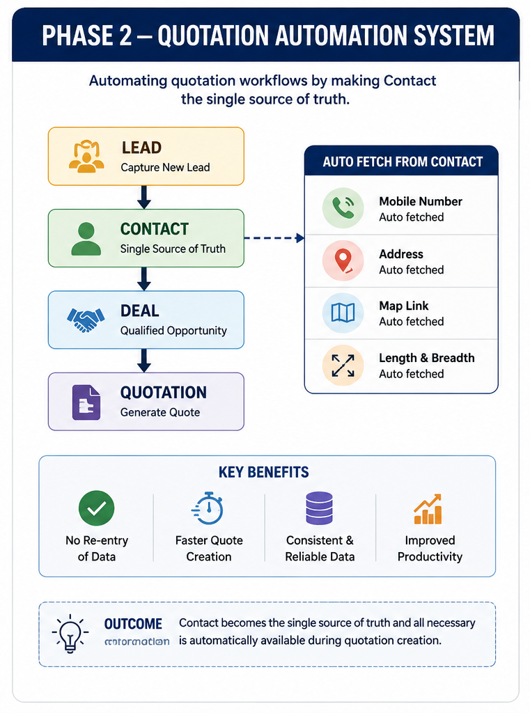
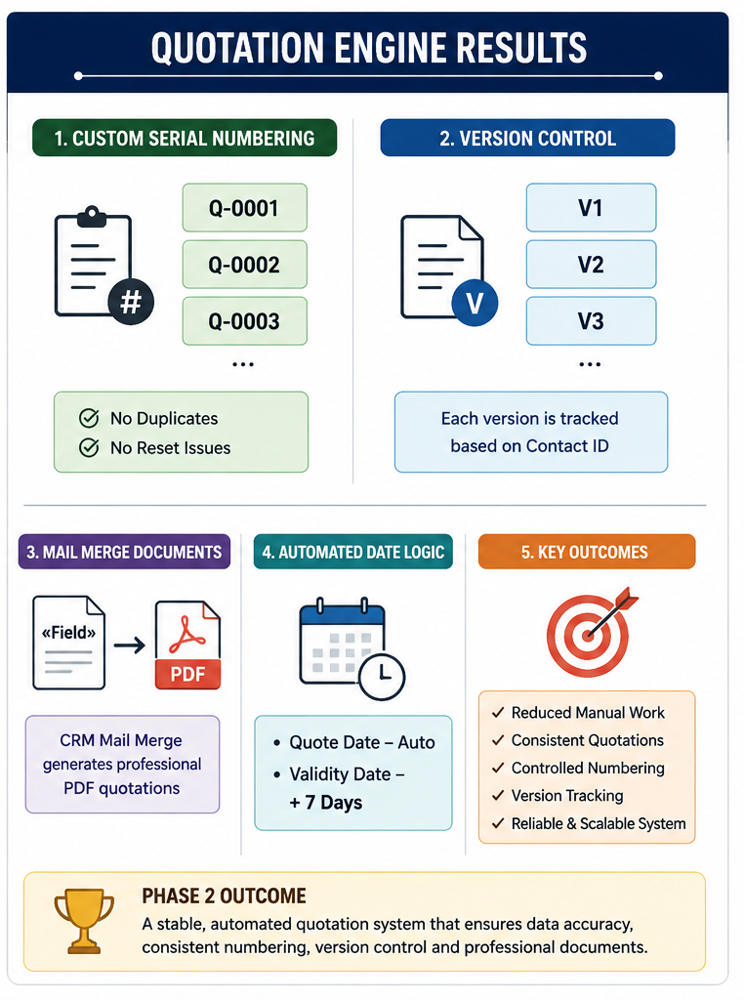

# Phase 2 — Quotation Automation System

## Overview

After establishing the CRM foundation in Phase 1, the next challenge was quotation management.

Although Leads, Contacts, and Deals were structured correctly, quotation generation still required repeated manual work and lacked proper control over numbering, versioning, and document generation.

This phase focused on transforming quotation creation into a reliable and automated process.

---


## Problems Identified

The existing quotation workflow required:

- Re-entering client information
- Manual data handling
- Inconsistent quotation numbering
- Difficult version tracking
- Workflow conflicts between automations

These issues increased operational effort and reduced process reliability.

---

## System Overview



---

## Solution Architecture

The quotation workflow was redesigned around a single source of truth.

```text
Lead
   ↓
Contact
   ↓
Deal
   ↓
Quotation
```

The Contact module became the central data source for quotation generation.

---

## Auto Fetch System

When a Contact is selected, the quotation automatically retrieves:

- Mobile Number
- Address
- Map Location
- Length
- Breadth

This eliminates duplicate data entry and improves consistency.

---

## Custom Serial Number Management

A dedicated System Settings module was introduced.

Features:

- Stores latest quotation number
- Auto increments on creation
- Prevents duplicate numbering
- Avoids reset issues after record deletion

---

## Version Control Logic

Quotation revisions are managed using Contact ID based filtering.

Benefits:

- Accurate version tracking
- Independent revision history
- Improved quotation management

---

## Automated Date Handling

Custom functions control:

- Quote Date
- Validity Date (+7 Days)

This prevents workflow conflicts and maintains consistency.

---

## Document Generation

CRM Mail Merge was implemented to generate quotation documents.

Example:

```text
«Quotes.Field_Name»
```

The CRM automatically populates quotation information and generates PDF-ready documents.

---

## Results & Automation Flow



---

## Technical Challenges Solved

- Workflow conflicts
- Lookup field inconsistencies
- Automation overlap
- Data overwrite issues

Business logic was consolidated into controlled custom functions to ensure system stability.

---

## Results Achieved

- Reduced manual work
- Improved quotation consistency
- Automated data retrieval
- Controlled numbering system
- Version management support
- Reliable document generation

---

## Technologies Used

- Zoho CRM
- Deluge
- CRM Mail Merge
- Workflow Automation
- Custom Functions

---

## Phase Outcome

Phase 2 focused on creating a stable and scalable quotation automation system that minimizes manual effort while maintaining data accuracy and operational reliability.

---

## Next Phase

Phase 3 will focus on Workflow Automation Layer, implementing advanced workflow triggers, process automation, and operational efficiency improvements across the CRM ecosystem.
