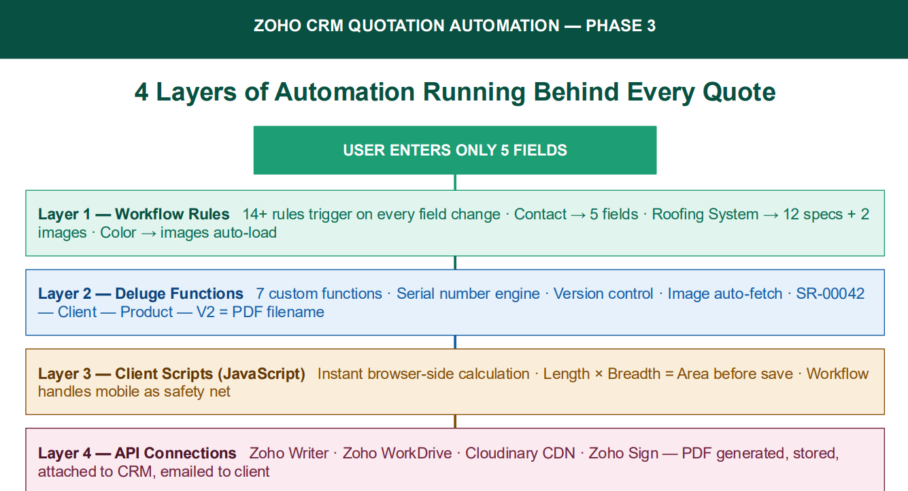
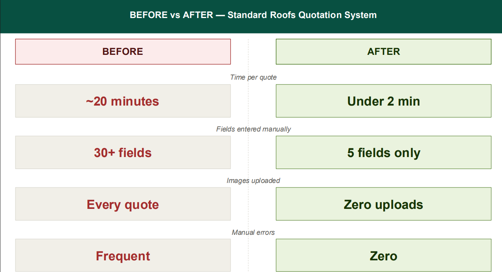
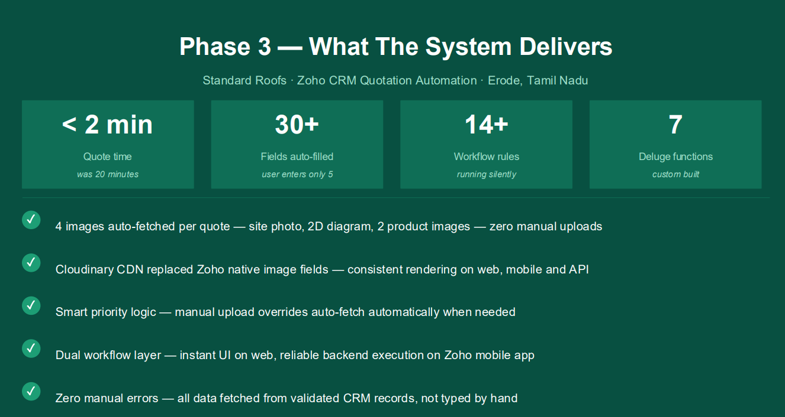

# Phase 3 — Building the Automation Engine

## Overview

Phase 3 focused on transforming the quotation process into an automation-driven workflow. The objective was to minimize manual data entry while improving consistency, speed and reliability during quotation preparation.

Instead of manually entering more than 30 quotation fields, the user now provides only a few essential inputs while the CRM automatically retrieves and processes the remaining information.

---

# Objective

Build a multi-layer automation system that reduces manual effort and enables faster quotation generation.

---

# Automation Architecture

## Layer 1 — Workflow Rules

Workflow automation was configured to automatically populate related information whenever key fields changed.

Implemented automations include:

- Contact selection → Customer details
- Roofing System → Roofing specifications
- Roofing System → Steel specifications
- Roofing System → Site images
- Product Color → Product images
- Supervisor / Manager / Accountant → Contact details

---

## Layer 2 — Deluge Functions

Custom backend functions were developed for:

- Persistent Serial Number Engine
- Version Control
- Subject Generation
- Date Management
- Image Retrieval
- Backend Business Logic

A custom serial number engine replaced Zoho's default Auto Number, preventing duplicate numbers and reset issues after record deletion.

---

## Image Automation

Images are retrieved automatically without manual uploads.

Automatically loaded:

- Site Image
- Roof Diagram
- Product Image 1
- Product Image 2

To improve reliability, image storage was migrated from Zoho native image fields to Cloudinary CDN.

---

## Layer 3 — Client Scripts

Client Scripts perform instant browser-side calculations.

Features include:

- Area Calculation
- Total Calculation
- Instant User Feedback

Equivalent workflow automation supports mobile users.

---

## Layer 4 — API Integrations

Integrated services include:

- Zoho Writer
- Zoho WorkDrive
- Cloudinary CDN
- Zoho Sign

These integrations prepare quotations for automated document generation, storage and delivery.

---

# Challenges Solved

- Prevented workflows from overwriting manual edits.
- Fixed quotation version calculation.
- Corrected lookup field formatting.
- Improved mobile workflow support.
- Increased image rendering reliability.

---

# Results

The completed system now provides:

- Only **5 user inputs required**
- **30+ fields populated automatically**
- **4 images automatically fetched**
- **14+ workflow rules**
- **7 custom Deluge functions**
- **Quotation preparation reduced to under 2 minutes**

---

# Technologies Used

- Zoho CRM
- Deluge
- JavaScript Client Scripts
- Zoho Writer
- Zoho WorkDrive
- Cloudinary CDN
- Zoho Sign

---

# Architecture Diagrams

## Automation Architecture

---

## Before vs After

---

## Final Results

---

# Disclaimer

This repository presents a generalized implementation created for learning and portfolio purposes.

No confidential customer information, company data or production configuration has been included.
