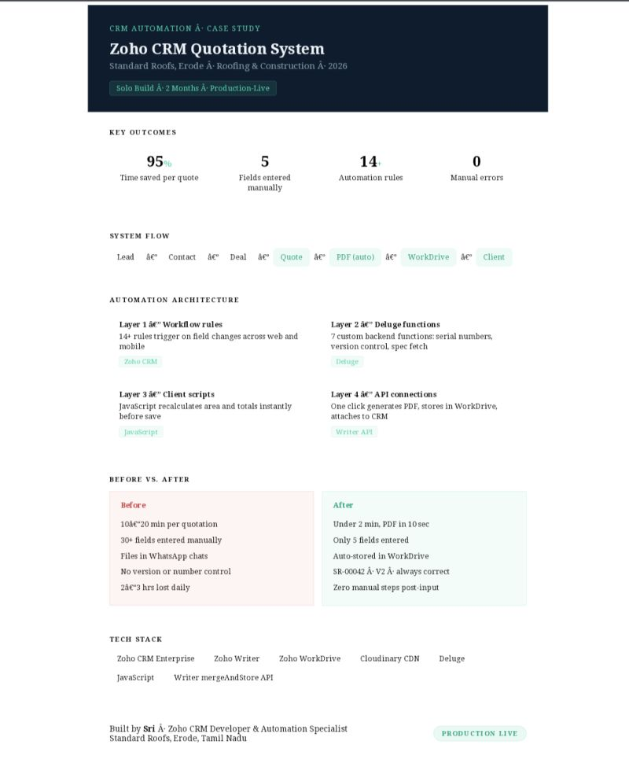

# Phase 4 — Automated Quotation Generation & Delivery

This phase completes the quotation workflow by automating everything after the user enters the required information.

Instead of manually generating, saving and sending quotation documents, the entire process is completed automatically through Zoho CRM integrations.

---

## Phase Overview



---

## Objective

Build a one-click quotation generation workflow that automatically creates, stores and delivers professional quotations.

---

## Workflow

```text
Customer Input
        │
        ▼
Generate Quote Button
        │
        ▼
Retrieve CRM Data
        │
        ▼
Zoho Writer Merge API
        │
        ▼
Load Images from Cloudinary
        │
        ▼
Generate PDF
        │
        ▼
Upload to WorkDrive
        │
        ▼
Attach PDF to CRM
        │
        ▼
Email Customer
        │
        ▼
Save Document Link
```

---

## Automation Implemented

- Auto-fetch CRM customer information
- Generate quotation using Zoho Writer
- Load project images from Cloudinary
- Generate PDF automatically
- Store document in Zoho WorkDrive
- Attach PDF to CRM Deal
- Email quotation to customer
- Save generated document link inside CRM

---

## Technologies Used

- Zoho CRM Enterprise
- Deluge
- Zoho Writer
- Zoho WorkDrive
- Cloudinary CDN
- JavaScript Client Scripts
- Writer mergeAndStore API

---

## Outcome

- One-click quotation generation
- Minimal manual effort
- Standardized document delivery
- Faster quotation processing
- Improved document management

---

Part of the **7-Phase Zoho CRM Automation Case Study**.
