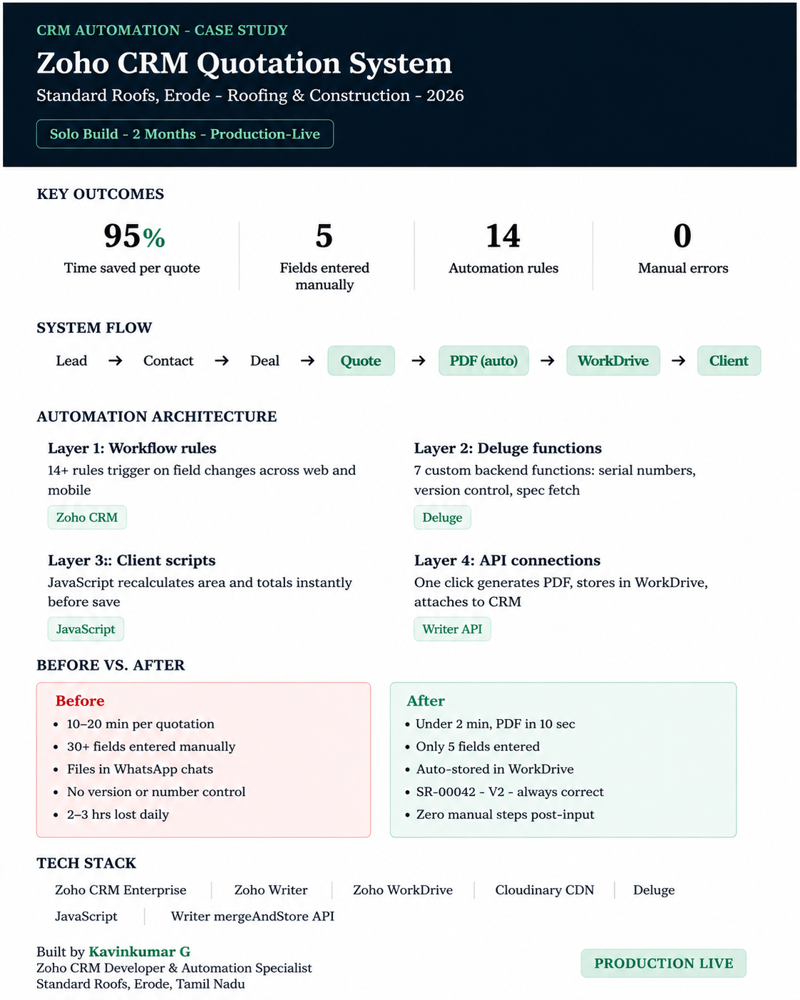

# Phase 4 — Automated Quotation Generation & Delivery

This phase focuses on automating the complete quotation generation and delivery process inside Zoho CRM.

After the user enters the required quotation details, the remaining workflow is executed automatically using Zoho CRM, Deluge, Zoho Writer, WorkDrive, and Cloudinary integrations.

---

# Phase Overview

<p align="center">
  
</p>

---

# Objective

Automate the complete quotation generation process with a single user action while ensuring consistency, accuracy, and centralized document management.

---

# Workflow

```text
Lead
   ↓
Contact
   ↓
Deal
   ↓
Generate Quote
   ↓
Zoho Writer Merge
   ↓
Generate PDF
   ↓
Upload to WorkDrive
   ↓
Attach to CRM
   ↓
Email Customer
   ↓
Save Document Link
```

---

# Automation Implemented

- Auto-fetch CRM quotation data
- Generate quotation using Zoho Writer
- Load project images from Cloudinary
- Generate PDF automatically
- Upload document to Zoho WorkDrive
- Attach PDF to CRM record
- Send quotation to customer via email
- Save generated document link back to the Deal

---

# Technologies Used

- Zoho CRM Enterprise
- Deluge Scripting
- Zoho Writer
- Zoho WorkDrive
- Cloudinary CDN
- JavaScript Client Scripts
- Zoho Writer Merge API

---

# Outcome

- One-click quotation generation
- Reduced manual work
- Automated PDF creation
- Centralized document storage
- Faster customer delivery
- Improved workflow consistency

---

**Project Status:** ✅ Completed

Part of the **7-Phase Zoho CRM Automation Case Study**.
